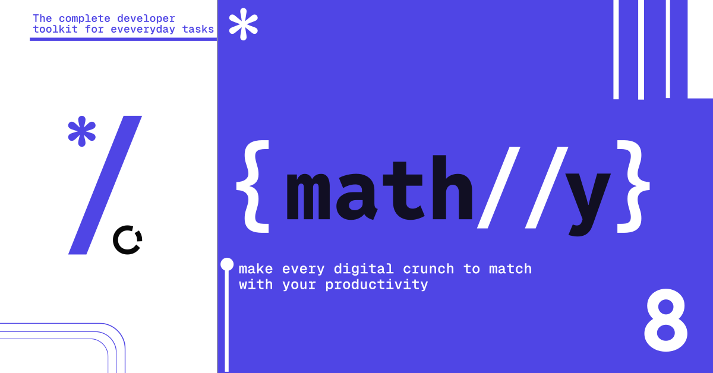

# Mathlly - Whitestar Studios
Mathlly is a sophisticated, developer-oriented calculator application built with Vue.js that combines powerful mathematical capabilities with an intuitive user interface. Designed for both everyday calculations and specialized developer needs, Mathlly offers multiple calculation modes, real-time base conversions, and advanced mathematical operations.

Unlike traditional calculators, Mathlly caters specifically to software developers and engineers with its Programmer mode featuring bitwise operations and multi-base number system support. The application balances technical functionality with an elegant, responsive design that works seamlessly across desktop and mobile devices.

With features like calculation history tracking, theme customization, and keyboard shortcuts, Mathlly transforms the calculator experience into something both more powerful and more accessible for technical users.

## Features

- **Multiple Calculator Modes**
  - Basic Calculator
  - Programmer Calculator (HEX, DEC, OCT, BIN)
  - Standard Calculator with advanced operations

- **Developer-Centric Features**
  - Real-time base conversion display
  - Programmer mode with bitwise operations
  - Keyboard shortcuts support
  - Scientific notation support

- **User Experience**
  - Dark/Light theme
  - History panel with local storage
  - Customizable settings
  - Real-time calculation preview
  - Mobile-responsive design
  - Tooltips system (auto-disabled on mobile)

- **Technical Highlights**
  - Built with Vue 3 + Composition API
  - State management with Pinia
  - Local storage using DexieJS
  - Efficient bundle size with Webpack analyzer

## Installation

```bash
# Install dependencies
pnpm install

# Serve with hot reload at localhost:8080
pnpm run dev

# Build for production
pnpm run build

# Lint and fix files
pnpm run lint
```
## Project Structure
```
src/
├── assets/         # Static assets (fonts, images, global CSS)
├── components/     # Vue components
├── composables/    # Composable functions
├── layouts/        # Page layouts
├── router/         # Vue Router configuration
├── stores/         # Pinia stores
├── utils/          # Utility functions and classes
└── data/          # Static data and configurations
```

## Key Dependencies
- Vue3 - Core framework
- Radix UI - Headless styling library
- Pinia - State management
- vue-router - Routing
- DexieJS - IndexedDB wrapper
- Decimal.js - Precise decimal calculations
- Mathjs - Mathematical operations

## Browser Support
Chrome, Firefox, Safari, Edge

## Contributing
Pull requests are welcome. For major changes, please open an issue first to discuss what you would like to change.

1. Fork the repository
2. Create your feature branch (`git checkout -b feature/amazing-feature`)
3. Commit your changes (`git commit -m 'Add some amazing feature'`)
4. Push to the branch (`git push origin feature/amazing-feature`)
5. Open a Pull Request

## License
This project is licensed under the MIT License.

## Acknowledgments
- Icons by Lucide
- Fonts: Inter, Geist Mono